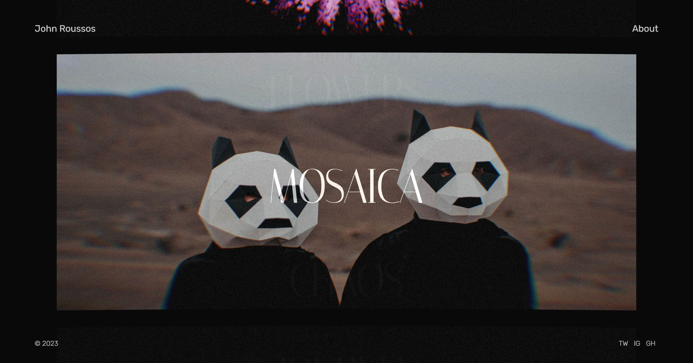

### Portfolio 2023

[](https://johnroussos.dev/)

## Local development

```bash
npm install
npm run dev
```

Media under `src/assets` is gitignored. The first `npm run dev` (or `npm run build`) runs `scripts/fetch-assets.mjs`, which downloads the required images, videos, and fonts from the live site into `src/assets`.

To refresh assets manually:

```bash
npm run setup:assets -- --force
```
